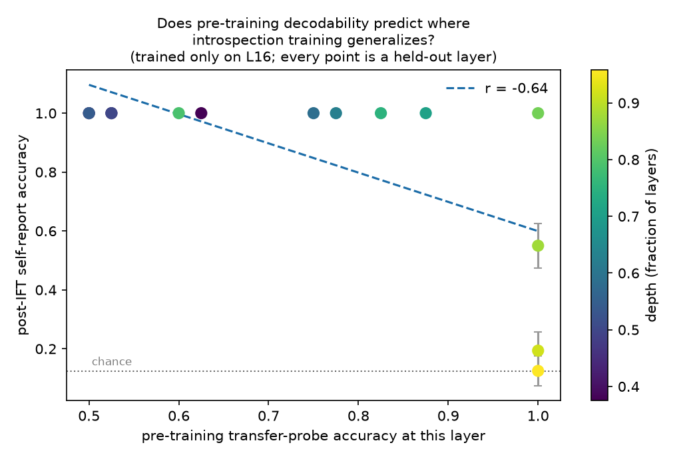

# activation-introspection

Can a language model report on interventions made directly to its own
activations — using access an outside observer would not have?

This repo is a laptop-scale testbed for that question, built around the confound
that decides it: a model that describes an injected concept may be reading its
internal state (**introspection**), or may simply be noticing that its own output
has drifted and inferring backwards (**behavioural inference**). Almost every
positive result in this area is compatible with the second explanation.

Every experiment here runs an **observer arm**: a clean copy of the model sees
only the intervened model's *output* and answers the same question. The headline
metric is the gap between the two, not the introspecting model's raw score.

See [`notes/00-literature.md`](notes/00-literature.md) for where this area stands
as of August 2026, [`notes/01-problem-space.md`](notes/01-problem-space.md) for
the full argument, [`notes/02-experiment-plan.md`](notes/02-experiment-plan.md)
for the pre-registered conditions, and
[`notes/03-lab-notebook.md`](notes/03-lab-notebook.md) for the dated record of
what broke and why.

## Why this exists

**The goal in one sentence:** measure how much of a model's internal state is
readable from its activations but *not* reachable by its own self-report.

I am an ML engineer moving into empirical AI-safety research, and I built this as
preparation for [SPAR](https://sparai.org) applications. Reading papers does not
demonstrate that you can run a controlled experiment on model internals; building
the apparatus, finding the confounds the hard way, and writing down the ones that
fooled me does.

The specific thing it demonstrates: this area is unusually good at producing
convincing false positives. Over the course of building it I measured a "perfect"
100% introspection result four separate times, and all four were artifacts —
attention-sink contamination, a degenerate null distribution, scoring tokens the
injection mechanically promotes, and a linear probe recovering a vector I had put
there myself. Each is documented in the lab notebook with the control that killed
it. Catching those is most of the skill.

### SPAR projects this is aimed at

| Project | Relevance |
|---|---|
| **Introspection Training for Verbalization of Activations** (Belinda Li, Anthropic) | Direct. The transfer probe measures the quantity that determines whether verbalization training has headroom — how much concept content is linearly present *before* any training. Both papers in this space ([IFT](https://arxiv.org/abs/2607.14111), [Introspection Adapters](https://arxiv.org/abs/2604.16812)) state they do not measure it. |
| **Faithfulness, Self-Knowledge, and Introspection** (Noah Siegel, Google DeepMind) | Direct. The whole design is built around separating genuine self-knowledge from behavioural inference, via the observer arm and matched-KL comparison. |
| **Deploying Programmatic Attention** (Belinda Li, Anthropic) | Indirect but shared machinery. The hook infrastructure that injects into the residual stream is what you would use to replace an attention head with a hand-written program; the natural extension is asking whether a model can detect that one of its own heads was swapped. |

### What it does not claim

Laptop-scale, 0.5B–1.5B models, one model family. Introspective report is
plausibly emergent, so a null here says little about frontier models. The
contribution is the measurement apparatus, the documented failure modes, and one
falsifiable prediction — not a frontier result.

## Status

Pipeline complete. Includes a working introspection-fine-tuning arm (LoRA, local),
which was used to test — and falsify — this repo's own central prediction.

## Headline result: what governs introspection-training generalization

*Introspection Fine-Tuning* ([arXiv 2607.14111](https://arxiv.org/abs/2607.14111))
lists **"mechanisms underlying the layer-agnostic generalization effect"** as an
open question. This repo offers a candidate answer, arrived at by predicting the
wrong thing and being corrected by the data.

I predicted that pre-training linear decodability would forecast where
introspection training generalizes. It does the opposite: r = **−0.774**.

What actually governs it is the **remaining compute budget** — how many layers
sit downstream of the injection. Fine-tuning at one layer, evaluated at all
others (n=37 layer evaluations across two training layers):

| | mean post-IFT accuracy |
|---|---|
| ≥4 layers remaining downstream | **0.957** (n=29) |
| ≤3 layers remaining | **0.346** (n=8) |

It is not distance from the trained layer: training at L16 generalizes *downward*
14 layers (L2 → 0.938) while failing *upward* at +5 (L21 → 0.550). The failure
boundary sits at the same absolute place regardless of where training happened.

**The dissociation that makes this interesting:** the collapse happens exactly
where an external linear probe reads the injected concept at **1.000**. The
information is present, linearly available, and unreportable.

> Decodability by an external probe is not usability by the model's own forward
> pass. The probe reads the residual directly; the model has to route that content
> through remaining layers into a token choice, and near the output there are none.



Two actionable consequences, neither requiring the training to be run: **train at
mid-depth** (L16 covers 19 layers, L8 covers 12), and **do not read late-layer
IFT failure as absence of the representation** — it is maximally decodable exactly
there.

Full derivation, and the four confounds caught along the way, in
[`notes/03-lab-notebook.md`](notes/03-lab-notebook.md).

## Earlier result: no introspective access at 0.5B

## Result

`Qwen2.5-0.5B-Instruct`, 1440 trials, 360 per arm:

| quantity | estimate | chance |
|---|---|---|
| detection AUROC, concept vs clean | 0.446 [0.403, 0.489] | 0.5 |
| detection AUROC, **shuffled null** | 0.484 [0.436, 0.529] | 0.5 |
| identification (8-way, digit-scored) | 0.106 [0.075, 0.139] | 0.125 |
| observer, same question from output only | 0.178 [0.139, 0.219] | 0.125 |
| **gap (introspector − observer), paired** | **−0.072** [−0.117, −0.031] | 0 |

The null arm bracketing 0.5 is what makes the rest readable. Identification sits
at chance, and the gap is *negative*: a clean copy of the same model, reading
only the intervened model's output, does better than the intervened model reading
its own activations.

### The circular metric

Scoring identification over concept *words* rather than digit indices produced
**1.000** accuracy — perfect 8-way identification from a 0.5B model. It is an
artifact, and the control that proves it is one extra forward pass:

| | accuracy (chance 0.125) |
|---|---|
| word-scored identification, question asked | 1.000 |
| **token promotion, no question asked** | **1.000** |
| token promotion on the shuffled control | 0.167 |

Concept vectors are contrast directions that raise the concept's own token, so
injecting one raises P(" ocean") mechanically. Asking the question adds nothing;
the shuffled arm at chance shows the control is specific rather than vacuous.

This generalises beyond this repo: **any concept-injection study that asks a model
to name the injected concept and scores the name is circular unless it runs the
no-question control.** The confound's effect size (1.000) exceeds any plausible
real effect, so a study omitting it is not weak evidence — it is no evidence.
`analysis.headline` now refuses to report a word-scored gap when the control
fires.

## The design

Six arms per cell, all run in one function so they cannot acquire separate
prompts, seeds, or bugs:

| arm | rules out |
|---|---|
| `clean` | response bias — the model saying YES regardless |
| `concept` | — |
| `shuffled` | "any perturbation triggers a report" (matched norm, permuted coords) |
| `random` | same, looser null |
| observer on `concept` | **behavioural inference** — a clean model reading only the output |
| observer on `shuffled` | observer-side bias |

The observer is the *same weights* with a fresh context, which holds capability
fixed and varies only whether the answer can draw on internal state. A stronger
observer would confound "no privileged access" with "better at the task".

Two gates decide whether a cell is interpretable at all, and `analysis.py` marks
a cell INVALID if either fails: the shuffled control must not detect above
chance, and the behavioural effect must be non-zero.

**The pre-verbalization arm is the detection score.** It is read at the first
generated position of a fresh context, so the model has emitted no task text and
behavioural inference has nothing to work from. There is deliberately no observer
comparison there — an observer would have nothing to read, which is the point.

## Setup

```bash
make setup
```

Run the pipeline:

```bash
uv run python scripts/run_sweep.py --model qwen-1.5b --seeds 5
```

Scale ladder (loads and frees one model at a time — holding two resident is what
pushes a 24 GB machine into swap):

```bash
uv run python scripts/run_ladder.py --models qwen-0.5b,qwen-1.5b,qwen-3b
```

Re-analyse a saved sweep without touching a model:

```bash
uv run python scripts/analyze.py results/ladder.jsonl
```

Python 3.12 via `uv`. Weights download into `./hf_cache` on first run so the
project stays self-contained; `make clean-cache` removes them.

## Smoke test

```bash
make smoke
```

Proves four things before any experiment is worth running: the model loads and
generates on this machine, hooks fire on the right blocks and are removed
afterwards, concept directions are mutually distinguishable, and injection at a
mid layer measurably changes the output while a matched-norm random direction
changes it less specifically.

Override the defaults:

```bash
uv run python scripts/smoke_injection.py --model qwen-7b --concept volcano --layer 18 --strength 3.0
```

## What's here

| Path | Purpose |
|---|---|
| `src/introspect/models.py` | Loading, device/dtype selection, architecture-agnostic block access |
| `src/introspect/hooks.py` | `capture` and `intervene` context managers; `Intervention` spec |
| `src/introspect/concepts.py` | Contrast-pair concept vectors, plus matched-norm random and shuffled controls |
| `src/introspect/prompts.py` | Detection, identification, and observer-arm elicitation |
| `scripts/smoke_injection.py` | End-to-end plumbing check |
| `tests/` | Position-mask and hook-hygiene tests against a stub model — no weights needed |

## Design notes

**Strength is normalised to the measured residual norm** at the injection layer
(`Intervention(normalize=True)`). Residual norm grows several-fold with depth, so
a fixed alpha across a layer sweep yields a monotone curve that is purely an
artefact of scale.

**Position masking is load-bearing.** `positions="generated"` is what makes the
pre-verbalization condition meaningful: if the model is asked to detect an
injection before emitting any task text, behavioural inference has nothing to
work from. The mask logic is unit-tested for exactly this reason.

**Controls are matched-norm, not absent.** `shuffled_control` permutes the
concept vector's coordinates, preserving norm and coordinate distribution while
destroying direction — a tighter null than Gaussian noise.

## Scale caveat

Introspective report is plausibly emergent. A 1.5B model may fail every condition
without that saying much about frontier models. The intended claim is about the
measurement apparatus and where the effect first appears across the scales that
fit on a laptop — not a frontier-model result.

## Licence

MIT.
