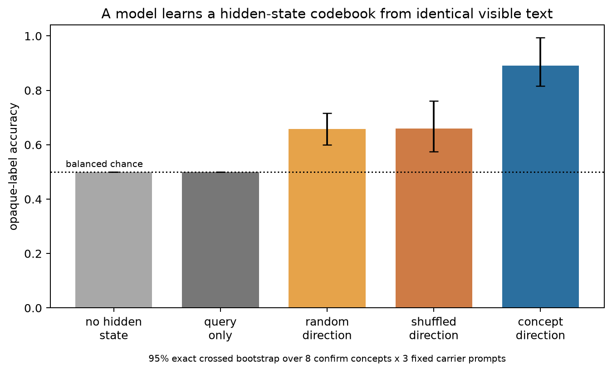
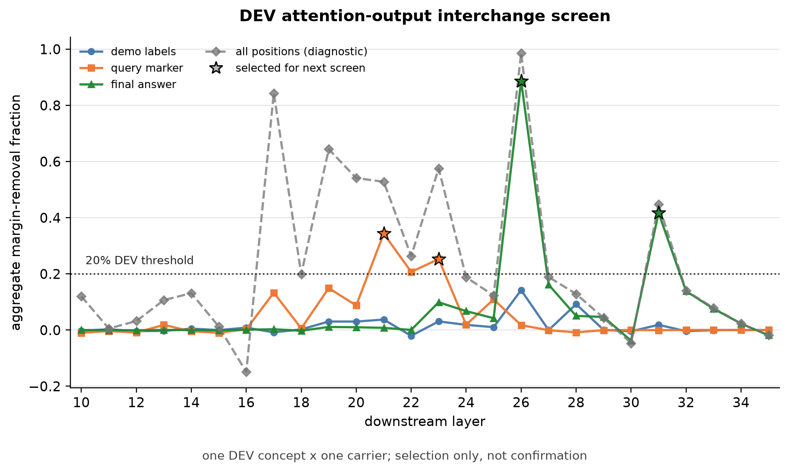

# A model learned an opaque codebook from causally hidden state

Empirical AI-safety portfolio by Skye Nygaard, for SPAR Fall 2026. The newest
result is a causal extension aimed at Belinda Li's introspection work, confirmed
under a frozen repair protocol after an adversarial audit; the earlier
retained-trace result is kept below and labeled as a replication.

## New result: in-context causal neurofeedback

I gave `Qwen2.5-3B-Instruct` four demonstrations of two hidden states called `Q`
and `K`. Within each episode, every visible observation was identical. The only
difference was a causal `+` or `−` edit to the residual stream at a marker token.
The mapping was reversed half the time, so the edit could not simply favor one
answer token.

The held-out query also had identical visible text. To answer, the model had to
infer the episode's arbitrary hidden-state-to-label mapping from the edited
demonstrations and apply it to a new hidden state.

Settings were chosen on one development concept. An initial held-out artifact was
then audited; it exposed a small query-scale mismatch, test-bank centering, and
weak provenance checks. I kept that artifact and froze a repaired confirmation
without changing the model, layer, strength, labels, or gates. The confirmation
uses eight concept directions absent from both earlier banks, three fixed carrier
strings (two new plus one anchor), and all 24 balanced combinations of four
demonstration orders, two label mappings, and two query states. Concept and
carrier—not the 24 enumerated cells—are the analysis units. A two-cell smoke was
viewed after the repair protocol was frozen and scored target 2/2; no setting,
gate, or stopping decision changed afterward.

| condition | opaque-label accuracy | exact crossed-bootstrap 95% interval |
|---|---:|---:|
| no hidden edit | 0.500 | [0.500, 0.500] |
| query edit only; no edited demonstrations | 0.500 | [0.500, 0.500] |
| random direction | 0.658 | [0.599, 0.717] |
| coordinate-shuffled concept direction | 0.660 | [0.575, 0.760] |
| **concept direction** | **0.891** | **[0.816, 0.995]** |

The concept direction beat the strongest random/shuffled direction by **23.1
percentage points** [13.7, 28.6], and beat the exactly scale-matched query-only arm
by **39.1 points** [31.6, 49.5]. It answered both members of a byte-identical
visible query pair correctly in 78.1% [63.2, 99.0] of pairs; query-only managed
3.5%. At the scored next token, every condition's full-vocabulary top choice was
a valid label.



The result supports one narrow claim: under this model/layer/interface, the
class-bearing variation was present only in causally varied residual states, and
the model used four demonstrations to infer an episode-remapped opaque codebook
without weight updates. It is not evidence of privileged self-access, a J-space
mechanism, natural-state reporting, safety-monitor robustness, or population-level
robustness. The nearest neurofeedback ICL work labels
activations induced by visibly different sentences; this matched-visible causal
extension eliminates that visible sentence-content shortcut. See the full
[protocol, controls, and limits](activation-introspection/notes/06-causal-codebook-icl.md).

### It replicates on concepts I never touched

The follow-up experiment below was run for a different reason, but its control
arm is the cleanest generalization check in this repository. Three concepts
(`bread`, `volcano`, `violin`) and two carriers, none of which appear in the
confirmation bank above or in any tuning step, give **0.958** target accuracy
against **0.500** for the exactly query-matched arm, with the right sign in all
six concept-carrier strata and 100% label format. The effect was not specific to
the eight concepts it was confirmed on.

### Then I trained one, and it caught me out

Everything above is a zero-weight-update intervention. So I trained a LoRA to do
the same job with the demonstrations removed: fit it on eight concept directions,
then ask it to name the sign of a hidden edit on eight directions and three
carriers it never saw.

The first version scored **0.917** on held-out directions and all three frozen
gates passed. It is not a result, and the same saved artifact says why: the
trained model put **5e-9** of its probability on the two answer tokens and never
once actually emitted one. The 0.917 was a forced choice between words the model
would not say.

The cause was one line. I had minimised cross-entropy over the two label logits
alone, which pins their *order* and leaves the rest of the vocabulary free, so
the optimiser quietly suppressed both labels while keeping the right one on top.
Restricting an introspection-training loss to the answer options gives you a
probe wearing the model's output head — and no forced-choice metric can see it.
Only an unrestricted full-vocabulary check catches it.

The repaired version changes only the loss. Format and label mass return to
1.000, and held-out accuracy falls to **0.583**. That 33-point drop is the
measurement of how much the broken version was inflating itself.

| | untrained | trained, random dir. | trained, shuffled dir. | **trained, concept dir.** |
|---|---:|---:|---:|---:|
| twin-pair accuracy | 0.000 | 0.250 | 0.208 | **0.583** |

A prompt-only strategy scores 0.000 here, and a coin flip 0.250, so 0.583 on
directions never trained on is a real effect — and it is direction-specific,
which the in-context version was not. It is also one seed, partial (the adapter
is perfect on its own eight directions and loses 41.7 points on the held-out
eight), and uneven across concepts. [Full write-up, including an error I left in
the frozen source and disclosed rather than
patched](activation-introspection/notes/07-trained-activation-reporter.md).

### The route turned out not to be compact, and that is the result

The safety question is whether a human-readable route can make an activation
report follow its hidden source rather than a spoofable visible cue. That needs a
small, inspectable set of attention components to program. So I went looking for
one, in two frozen stages.

A one-concept screen (Stage 1a) found candidate sensitivity at the query marker
(layers 21/23) and the final answer (layers 26/31). A second frozen screen
(Stage 1b) then tested all 64 layer-role-head components across the three fresh
concepts and two carriers — 5,112 scored forwards, with the analyzer hash-locked
and its stop rule written before any output was seen.

**It failed its own gate, twice over.** One of the four parent layers dropped to
16.2% margin removal against a 20% threshold. And six individual heads qualified
where the protocol allowed 2–4, with the three layer-26 heads together exceeding
110% of their own parent's effect — redundant paths, not a decomposition. The
pre-registered response to "influence is diffuse" is to stop, so the fixed-route
program study does not proceed.



I would rather report that than a version of it that passed. Two honest limits on
the stop itself: the screen only tests single query heads at four preselected
sites, so a route spread over head pairs or the KV side would look identical to
this; and the screen carries **no damage control**, so a large removal fraction
cannot be separated from a component simply being disruptive to perturb. That
control was deferred to the next stage, which means a passing screen would have
been no more interpretable than this failing one. That is a design error, and it
belongs inside the screen next time.

### On the efficiency half of the same project

Programmatic attention is a deployment project: the question is whether readable
QK circuits run in real systems at acceptable cost to *both* behavior and speed.
So the systems measurement is evidence, not an appendix. I lowered one released
GPT-2 positional program to an exact `O(TD)` form, removing the `T×T` matrix, Q/K,
and softmax for that head. On CPU fp32 it is numerically equivalent across 216
cells (max abs error 4.8e-7) and **18.63×** [18.45, 18.83] faster as an isolated
operator at `B=1, T=1024`.

Integrated into a real GPT-2 attention module via native head pruning, that
collapses to **1.089×** [1.088, 1.091], missing the 1.25× threshold I froze
beforehand. The algebra was never the bottleneck; partial-head projection and
dispatch are. That is a negative result on a question the project actually asks,
and it localizes where the cost sits.

## Earlier result: a trace can be stored but unusable

I planted an idea inside a small language model, then checked two things
separately: whether the idea was still in there, and whether the model could
actually use it.

Here is the setup, step by step.

1. The model reads a short, neutral piece of text. While it reads, I reach inside
   and add a "concept" to its internal state. Think of it as slipping the idea of
   *ocean* into the model's working memory while it is thinking about something
   else.
2. I remove the thing that added it, and check on every single trial that it is
   really gone. From here on, nothing is being pushed into the model. Only the
   after-effects remain.
3. **Now** I invent a code, on the spot: *ocean means Q, bread means K*, and so
   on. I paste that code in and ask which letter applies.
4. The model has to answer with a letter.

Step 3 is the part that matters. The code did not exist when I planted the idea,
so the planting cannot have been secretly aimed at the answer. Whatever the model
does here, it has to do by actually using what it kept.

There are eight concepts and eight letters, so guessing gets you 1 in 8, or 0.125.

## What happened

Two measurements, on the same model state.

- **Use:** can the model answer the question? I score the letter it picks.
- **Storage:** is the idea still in there at all? I train a simple reader on
  ordinary text, then point it at the model's internal state and ask what concept
  it sees. The reader never sees the experiment. It only knows what *ocean* and
  *bread* normally look like inside this model.

The one thing I varied is *how deep* into the model I planted the idea. The model
has 24 layers, so layer 2 is near the front and layer 22 is near the back.

| planted at layer | 2 | 6 | 10 | 14 | 18 | 22 |
|---|---|---|---|---|---|---|
| **use** (picks the right letter; guessing = 0.125) | **0.500** | 0.193 | 0.198 | 0.125 | 0.130 | 0.141 |
| **storage** (the reader finds the idea) | 1.000 | 1.000 | 1.000 | 0.958 | 1.000 | 1.000 |

Read the two rows against each other. The bottom row never drops. The idea is
always in there, and a simple reader finds it every time, no matter where it was
planted. The top row falls to chance by layer 14. The model stops being able to
answer with it.

**So the information does not go missing. The model just loses the ability to
reach it.** Plant early and it can use what it kept. Plant late and it cannot,
even though the idea is sitting right there.

## The obvious objection

If I add something to the model and then a reader finds it, maybe the reader is
just seeing the thing I added. That would make the bottom row meaningless.

So I tested it. I built a fake version of the model's final state: the clean,
untouched state, plus exactly the same thing I had added, glued on at the end with
no thinking in between. If the reader were only seeing what I added, this fake
should score just as well.

It scores **0.167**. The real one scores **1.000**. The added piece on its own
scores between 0.125 and 0.375, which is roughly guessing.

So the reader is not seeing the raw addition. The model's own layers have to
process it first, and turn it into something that looks like the model's ordinary
idea of *ocean*. That processing is the thing doing the work.

One more check, in the other direction. There is a single case where the reader
*should* be fooled: plant the idea and read it in the same place, with no layers
in between. That case comes out at 1.000 for both the real and the fake version.
The test can detect the problem. It just does not find it anywhere else.


## What this is worth, honestly

**It has been done before.** After I built it, I went looking for prior work and
found that the basic setup is Lindsey's, and that the pattern of "only works if
you plant it early" is already published for a bigger model. So this is a
replication, and I label it that way everywhere.

What I would still call mine: the made-up-afterwards code in step 3, which closes
a loophole this repository previously fell into, plus the fake-state check above,
and running it across three model sizes. The full accounting is in
[LITERATURE-BOUNDARY.md](spar-application/LITERATURE-BOUNDARY.md).

**It proves something narrow.** It shows the model used something it kept. It does
not show the model knows anything about itself, can inspect itself, or has any
special access to its own workings. Those are different claims and I have not
tested them.

## The part I would actually point a mentor at

The experiment above is a replication. How I handled it is not.

I work out what a measurement really measures. I look for the ways an experiment
can produce a convincing result for the wrong reason. And when a fixed comparison
kills a result, I drop the result.

[CLAIMS.md](spar-application/CLAIMS.md) grades every statement in this repository,
including the ones that did not survive. Among them:

- A headline correlation of `-0.774` that I retracted, because the two halves of
  the comparison were measured at different places in the model. It was comparing
  apples to oranges and I had not noticed.
- A "100% accuracy" result, killed by my own control once I ran it.
- Three "controls" that turned out to be arithmetic. They could not have failed no
  matter what the model did, so they proved nothing.
- A feature meant to randomize which feedback the model got, that never actually
  randomized.

I do the same thing in unrelated work. My [ARC White-Box Estimation
Challenge](https://github.com/SkyeNygaard/AI-Safety-Roadmap) repository keeps the
same kind of ledger next to a graded competition entry and a proof. Different
field, same habit. Doing it once is a habit. Doing it twice, independently, is a
method, and the method is what I would bring to a project.

## What is not here

**More than one training seed.** The trained reporter is a single LoRA run, which
cannot separate the effect from initialisation luck. Independent seeds are the
first thing that experiment needs.

**A route to program.** The localization line ran two frozen stages and stopped on
the second. There is no circuit, no program, and no shortcut-robustness result.

**A frontier-scale claim.** One model family, 0.5B–3B, one layer, one strength,
binary labels, CPU fp32.

## Where to go next

- [`spar-application/`](spar-application/) is the full write-up. It covers the
  checks that passed, the checks I withdrew after realising they were empty, where
  the comparison is not perfectly fair, and how this maps onto each of the six
  projects.
- [`activation-introspection/`](activation-introspection/) contains every executed
  activation experiment — the causal codebook, the retained-trace replication, the
  two attention screens, and the lowering benchmark — with their raw rows and the
  code that runs them.
- [`adaptive-monitor-sandbox/`](adaptive-monitor-sandbox/) is the second, unfinished
  line of work: a small world where an AI agent tries to get something past a
  monitor.
- [`AI_ASSISTANCE.md`](AI_ASSISTANCE.md) says how much of this was done with AI
  help. It was a lot, including the review that caught several of the mistakes
  listed above. That is a useful check, but it is not an independent one.

## Running it yourself

Each folder has its own setup and its own tests. Both work from a fresh copy:

```bash
cd activation-introspection && make setup && make check
cd ../adaptive-monitor-sandbox && make setup && make check
```

Every number in the new causal result can be rebuilt from committed raw per-trial
data. The settings, model version, prompts, source digest, and frozen protocol are
stored next to it. Older artifacts that do not meet that standard are labeled.
[AUDIT-MANIFEST.md](spar-application/AUDIT-MANIFEST.md) has the commands.

The two code folders were built separately and joined here with `git subtree`, so
each keeps its own history. That history shows the corrections happening as they
happened, which is part of the point.

## License

MIT. See [LICENSE](LICENSE).
