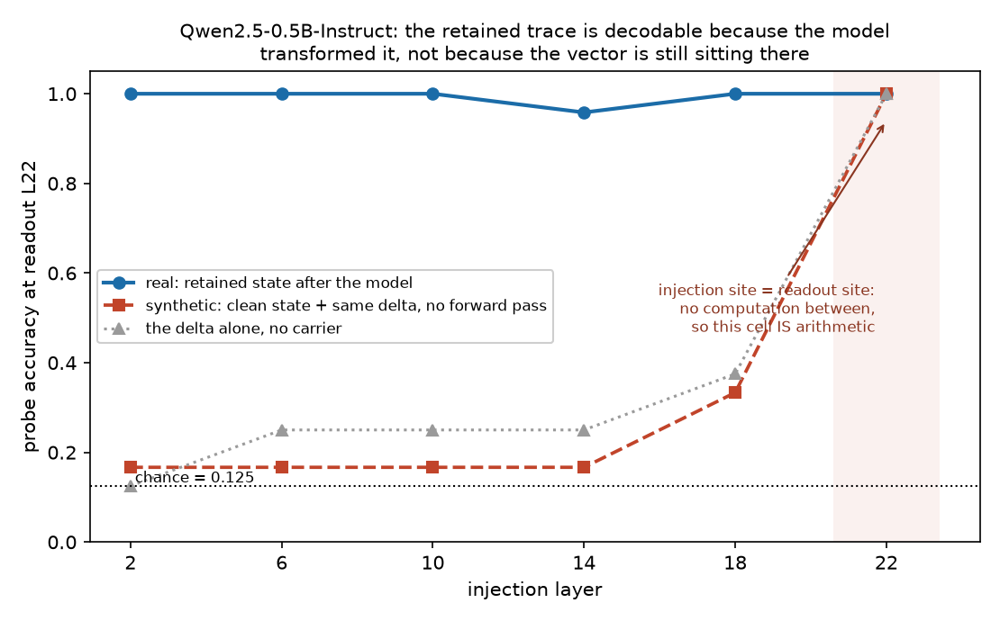

# A retained activation trace stays decodable after it stops being usable

Empirical AI-safety portfolio — Skye Nygaard, SPAR Fall 2026. One executed study,
two pilot repositories, and a claim ledger that includes the results that did not
survive.

`Qwen2.5-0.5B-Instruct`. A concept vector is injected while a neutral carrier's
KV cache is built; the hook is removed and asserted absent on every trial; only
then is a freshly sampled concept→label codebook revealed and the label scored.
**The codebook cannot have been targeted by the edit, because it did not exist
yet.** Strength was frozen on a disjoint development bank. The held-out bank was
run once.

| inject layer | 2 | 6 | 10 | 14 | 18 | 22 |
|---|---|---|---|---|---|---|
| **use** (label accuracy, chance 0.125) | **0.500** | 0.193 | 0.198 | 0.125 | 0.130 | 0.141 |
| **storage** (probe on the same retained state) | 1.000 | 1.000 | 1.000 | 0.958 | 1.000 | 1.000 |

**The trace is fully retained and linearly recoverable at readout depth from every
injection depth. What collapses is the model's ability to route it into a symbolic
lookup.**

## The objection, and the control that answers it

A probe recovering an injected direction may have recovered only what was added.
So I measured it. Rebuilding the readout state as the *clean* carrier plus the
identical delta, with no forward computation in between, scores **0.167** where
the real arm scores **1.000**; the delta on its own scores 0.125–0.375. The
alignment with the model's own natural-text representation is produced by the
intervening blocks. The one cell where the artifact *is* present by construction
— injection site equal to readout site, nothing computed between — comes out at
1.000 for both, which is what the artifact looks like when it is real.



## What it is, and what it is not

**It is a replication.** A literature check run against the as-built design found
that the transient-cache schedule is Lindsey's and the early-layer-only depth
profile is already published for Llama-3.1-8B. The contribution is the answer
space — an arbitrary post-hoc codebook, which forecloses the token-promotion
artifact this repository previously fell for — plus the propagation control above
and the scale ladder. The boundary is drawn in
[LITERATURE-BOUNDARY.md](spar-application/LITERATURE-BOUNDARY.md).

It licenses causal use of a retained trace at early injection sites, in this
model, through this interface. It does **not** license introspection,
self-knowledge, or privileged access.

## The method, which is the point

The result above is a replication. What is not standard is the apparatus around
it: I work out what an experiment actually measures, catch the artifacts that
fake a result in either direction, and drop a claim when a corrected comparison
kills it.

[CLAIMS.md](spar-application/CLAIMS.md) grades every statement in this repository,
including the ones that did not survive — a retracted `r = −0.774` headline that
compared two different injection sites, a "100% identification" result killed by
its own no-question control, three control arms found to be arithmetic identities
that could never have failed, and a randomized-response feedback channel that
turned out never to randomize.

I keep the same ledger in unrelated work. My [ARC White-Box Estimation
Challenge](https://github.com/SkyeNygaard/AI-Safety-Roadmap) repository carries a
`claims.csv` with per-claim evidence status alongside a graded competition
submission and a proof. Different field, same discipline. One evidence ledger is
a habit; two independent ones is a method.

## Scope

**One executed study and two pilot repositories.** Not six projects' worth of
results, and it does not pretend to be.
[PROJECT-BRIEFS.md](spar-application/PROJECT-BRIEFS.md) records what I would do on
each of the six SPAR projects I am applying to, and is deliberately unflattering
where three of them are proposal-only.

## Where to go next

- [`spar-application/`](spar-application/) — **the full write-up.** Gates passed
  and gates withdrawn, damage matching stated honestly, the scale ladder, and the
  appendix mapping this work to each of the six projects.
- [`activation-introspection/`](activation-introspection/) — the retained-trace
  study and its apparatus.
- [`adaptive-monitor-sandbox/`](adaptive-monitor-sandbox/) — the control sandbox
  and the Study 3 design.
- [`AI_ASSISTANCE.md`](AI_ASSISTANCE.md) — what was agent-assisted. Most of it
  was, including the review pass that found several of the defects above, which
  is a useful check and not an independent one.

## Reproducing it

Each subdirectory carries its own `pyproject.toml`, tests, and verification
contract, and both pass from a fresh clone:

```bash
cd activation-introspection && make setup && make check
cd ../adaptive-monitor-sandbox && make setup && make check
```

Every headline number is regenerable from committed raw per-trial rows, with
config, prompt hashes, model revision, and environment recorded alongside.
[AUDIT-MANIFEST.md](spar-application/AUDIT-MANIFEST.md) gives the commands and
the artifact policy.

The two code repositories were developed separately and merged here with
`git subtree`, so their individual commit histories are intact. That history
records the corrections as they happened and is part of the evidence.

## License

MIT. See [LICENSE](LICENSE).
