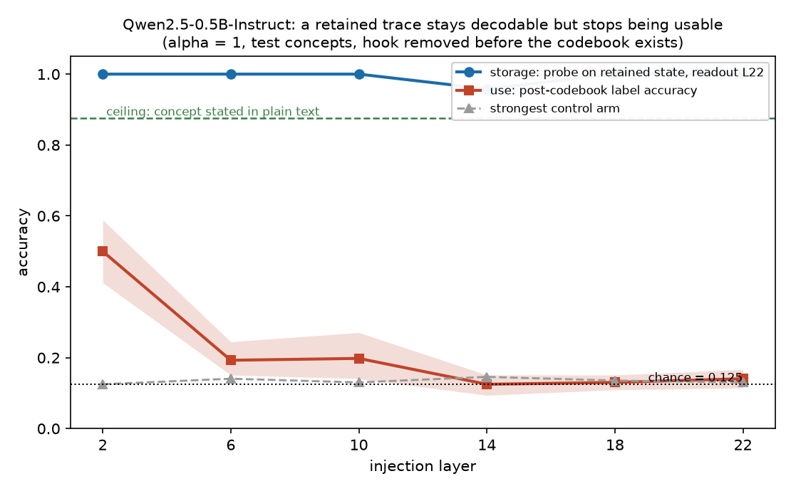
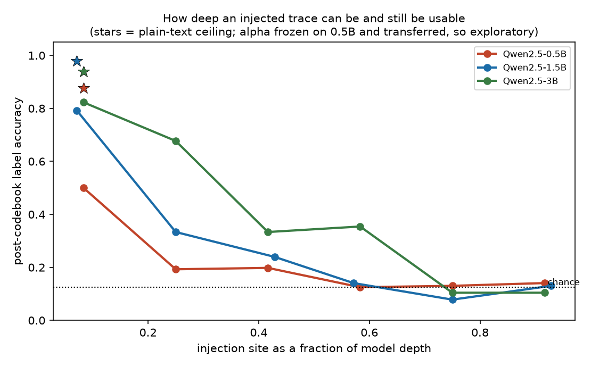

# activation-introspection

Edit a language model's activations, then take the edit away. Can the model still
use what you did to it?

Here the answer is **yes, but only if the edit happens early in the network**.
and the reason it fails later is not the obvious one. The injected concept is
still present at the end of the network no matter where you put it: a linear
probe reads it back perfectly from every injection depth. What breaks is the
model's ability to *do anything with it*.



`Qwen2.5-0.5B-Instruct`, 8 held-out concepts, 6912 trials, run once. Chance is
0.125.

| injection layer | 2 | 6 | 10 | 14 | 18 | 22 |
|---|---|---|---|---|---|---|
| **use**, can the model answer with it? | **0.500** | 0.193 | 0.198 | 0.125 | 0.130 | 0.141 |
| **storage**, can a probe read it off? | 1.000 | 1.000 | 1.000 | 0.958 | 1.000 | 1.000 |

That storage row is worth one more question: is the probe reading the model, or
reading back the vector I added? Rebuild the readout state as the *clean* carrier
plus the identical delta, with no forward computation in between, and it scores
**0.167** where the real arm scores 1.000. The intervening blocks are what make
the injected direction legible to a boundary fit on ordinary text.


The rightmost cell is the control failing on purpose: when the injection site is
also the readout site, capture happens on the block the edit was applied to, and
synthetic rises to meet real at 1.000. That is what this artifact looks like when
it is genuinely present, which is why the other five cells mean something.
| best control arm | 0.125 | 0.141 | 0.130 | 0.146 | 0.135 | 0.130 |

Storage is not the bottleneck. Readout is. Full protocol, controls, and the
things that could still be wrong: [`notes/05-retained-trace.md`](notes/05-retained-trace.md).

## How the experiment works

1. Show the model a short, neutral note. It mentions no concept at all.
2. While the model reads that note, add a concept direction to its residual
   stream, and keep the resulting KV cache.
3. Remove the hook. Assert in code that no hook is registered any more.
4. *Now* invent a random mapping from concepts to meaningless letters (`ocean =
   Q`, `bread = K`), paste it in, and ask which letter applies.

The order is the whole point. The codebook does not exist while the edit is live,
so the edit cannot have nudged the model toward whichever letter turns out to be
correct.

That matters because the obvious version of this experiment does not work.
Injecting "ocean" mechanically raises the probability of the token `" ocean"`, so
scoring the concept word measures the injection rather than the model. This repo
hit exactly that: a "perfect" 100% identification result that a no-question
control reproduced at 100%. Details in
[`notes/03-lab-notebook.md`](notes/03-lab-notebook.md).

Because every concept is assigned every letter equally often, chance is exactly
`1/8`. The two do-nothing arms land on exactly 0.125 at every site, but note
what that can and cannot show. They run one forward per (carrier, codebook) and
score it against all eight concepts, so with cyclic codebooks exactly one of the
eight rows is correct however the model behaves. They confirm the pipeline is
wired correctly; they cannot fail. The arms that could fail are the ones carrying
a per-concept edit: `random` and `shuffled`.

## What would have to be true for this to be wrong

Each of these was checked, and each is a way the headline could have been an
artifact:

| worry | check | result |
|---|---|---|
| The model just can't do this task | State the concept in plain text, everything else identical | 0.875, so a null at depth means something |
| The prompt leaks the answer | `clean` arm: identical text, no edit at all | 0.125, but by arithmetic. A wiring check, not a test |
| Merely running a hook does something | `sham` arm: same hook, strength zero | 0.125, same caveat |
| Any perturbation would do | Coordinate-shuffled edit, per concept | 0.125 to 0.146. The control that could have failed |
| The edit just broke the output format | Restrict to trials where the model still emits a letter | 0.435 at layer 2, still far above chance |
| One lucky concept carries the mean | Per-concept breakdown | 6 of 8 above twice chance |
| The probe is reading the vector I injected | Rebuild the readout-22 state as clean + the same delta, no forward computation in between, and probe that | 0.167 against 1.000 for the real arm. The blocks did the work |

The honest remaining weakness: the arms are matched on vector *norm*, not on how
much damage they do. At layer 2 the real concept perturbs the model about 50%
more than a random direction of the same size, because it points somewhere the
model actually uses. The best-matched control still loses 0.500 to 0.125, so this
does not explain the result, but a cleaner run would calibrate each arm to the
same damage level.

The 3B run answers that objection where it matters most. At its layer 21 the
control arms disturb the model *more* than the real concept does (KL 1.83 and
2.91 against 1.22) and still sit at chance, while the target reaches 0.354. That
cell cannot be explained by damage in the direction the objection requires.

## Scale

Same experiment at three sizes, plotted against injection site as a fraction of
model depth:



| depth | 0.5B | 1.5B | 3B |
|---|---|---|---|
| ~8% | 0.500 | 0.792 | 0.823 |
| ~25% | 0.193 | 0.333 | 0.677 |
| ~42% | 0.198 | 0.240 | 0.333 |
| ~58% | 0.125 | 0.141 | 0.354 |
| ~75% | 0.130 | 0.078 | 0.104 |

The point where the channel closes **moves later with scale**. 3B is still well
above chance at 58% depth, where both smaller models are dead. All three are gone
by 75%. Three points is not a scaling law, but the direction is the one that
would reconcile this with Lindsey's report of frontier introspection peaking
about two-thirds of the way through the model.

These runs are exploratory: strength was frozen on 0.5B and carried over without
recalibrating per model, so the arms are not damage-matched across scales. Read
the shape rather than the individual heights.

## This is a replication, not a discovery

I checked the literature against the design I had actually built, and it came
back worse than I hoped:

- Removing the steering vector before querying is **Lindsey's** design (arXiv
  2601.01828), not mine. My own literature note already said so.
- [arXiv 2602.20031](https://arxiv.org/abs/2602.20031) runs the same
  transient-cache protocol on a 32B model.
- Krasheninnikov et al. (arXiv 2512.12411) already report that these capacities
  are confined to early-layer injections and collapse to chance after, which is the same
  profile measured here, on Llama-3.1-8B.

What is left that is mine: the answer space (an arbitrary codebook sampled after
the edit, which none of the cited work uses) and the scale. The claim this
licenses is "the model causally used a retained trace". Not introspection, not
self-knowledge, not privileged access.

## Why this repo exists

I am an ML engineer moving into empirical AI-safety research, and I built this
preparing for [SPAR](https://sparai.org) applications. Reading papers does not
show that you can run a controlled experiment on model internals. Building the
apparatus, hitting the confounds, and writing down the ones that fooled you does.

This area is unusually good at producing convincing false positives. While
building this I measured a "perfect" 100% result four separate times, and all
four were artifacts: attention-sink contamination, a degenerate null
distribution, scoring tokens the injection mechanically promotes, and a probe
recovering a vector I had planted myself. Each is in the lab notebook with the
control that killed it. Catching those is most of the skill.

### SPAR projects this is aimed at

| Project | Relevance |
|---|---|
| **Introspection Training for Verbalization of Activations** (Belinda Li, Anthropic) | Direct fit. The result says what training would have to fix: the concept is already stored perfectly, so the deficit is in readout, and it is specific to injection site rather than uniform. |
| **Faithfulness, Self-Knowledge, and Introspection** (Noah Siegel, Google DeepMind) | Direct fit. A concrete decodable-but-unusable case, with the answer token made impossible to promote by construction. It also comes with the history of retracting an earlier, badly-controlled version of the same claim. |
| **Deploying Programmatic Attention** (Belinda Li, Anthropic) | Adjacent plumbing only, not evidence for this project. A real bridge would replace selected QK attention with a sparse executable rule and measure quality, latency, and memory against the learned head. |

### What it does not claim

One model family, 0.5B–3B, one task, one interface. Introspective report is
plausibly emergent, so nothing here constrains frontier models. Read the
apparatus, the documented failure modes, and one carefully scoped replication.
not a frontier result.

Background reading: [`notes/00-literature.md`](notes/00-literature.md) for the
state of the area, [`notes/01-problem-space.md`](notes/01-problem-space.md) for
the argument, [`notes/03-lab-notebook.md`](notes/03-lab-notebook.md) for the
dated record of what broke.

## Status after the 2026-08-01 claim audit

The apparatus is usable for pilots; the committed numerical results are **not a
confirmatory result**. The audit found failures in both directions and retracts
the former headline.

| former claim | audited status |
|---|---|
| fixed-source probe transfer anti-correlates with post-IFT accuracy (r = −0.774) | **Retracted.** It compared inject-at-L8/read-at-L with inject-at-L/read-at-output. Those quantities have opposite mechanical depth trends. |
| “decodability is not usability” in this experiment | **Retracted.** A matched-site audit reconstruction reversed the sign, so the old comparison cannot support that slogan. The reconstructed positive association is not replacement evidence because both joined artifacts fail the current provenance/inference contract. |
| remaining layers are the mechanism | **Downgraded to an intervention-placement diagnostic.** The edit is applied after a block; at L23 no trainable LoRA block remains downstream to read it. L1 is also a counterexample: it has 22 layers left but legacy post-IFT accuracy was 0.175. |
| negative introspector−observer gap proves no access | **Unsupported.** A concept×prompt clustered interval recomputed during audit was [−0.236, 0.047], unlike the old IID interval [−0.117, −0.031]. The asymmetric observer design also has false-negative risk. |

During the audit I recomputed that comparison properly, matching the injection
site on both sides. It came out **positive**, with r between 0.87 and 0.97 depending
on the run. I am not claiming that either. Both halves of the join are old
aggregates with no raw trials, no model revision, and no provenance, and adjacent
layers are not independent points. It is a debugging clue, not a replacement
result. `scripts/run_reach_output.py` is the runner that would produce a real
version, and `scripts/run_ift.py` now refuses the old mismatched profile
outright.

The old LoRA runs have their own problems. Evaluation ran with adapter dropout
still switched on. A few prompt paraphrases were repeated and counted as
independent seeds. A fixed option order gave every concept a permanent digit, so
an adapter could memorise the mapping instead of reading it. And the vector bank
built at the training layer was reused at held-out layers. The code is fixed; the
old JSON files and the figure below are kept as a record of the failed pilot, not
as evidence.


The full ledger and the threats in both directions are in
[`notes/04-claim-audit.md`](notes/04-claim-audit.md); the dated history is in
[`notes/03-lab-notebook.md`](notes/03-lab-notebook.md).

## What comes next

The retained-trace experiment above was the gate, and it passed at early
injection sites. That unblocks the study below, with one constraint the result
imposes: the sibling comparison has to run somewhere the reporting channel is
still alive. Past the midpoint every arm sits at chance, so a comparison there
would measure the readout collapse instead of the thing it is meant to measure.

The next experiment builds two sibling models from one base checkpoint using
independent, compute-matched adapters. Each sibling then reports on three kinds
of activation: its own, its sibling's raw, and its sibling's mapped into its own
coordinates by a frozen orthogonal transform fitted on separate unlabeled text.

The question is whether an apparent "I read my own activations better than yours"
advantage survives once the coordinate mismatch is removed. If it vanishes after
alignment, the advantage was representational compatibility all along. If it
survives in **both** directions with decodability, reconstruction, damage, and
format all matched, that is a residual worth reporting, though still only
"compatibility beyond the transform I happened to test", not metacognition. An
effect in one direction only is model heterogeneity, and does not get pooled into
a claim about self-access.

Proposed, not implemented. Stop rules in
[`notes/04-claim-audit.md`](notes/04-claim-audit.md).

## Earlier exploratory sweep: no positive evidence under this instrument

`Qwen2.5-0.5B-Instruct`, 1440 trials, 360 per arm:

| quantity | estimate | chance |
|---|---|---|
| detection AUROC, concept vs clean | 0.446 [0.403, 0.489] | 0.5 |
| detection AUROC, **shuffled null** | 0.484 [0.436, 0.529] | 0.5 |
| identification (8-way, digit-scored) | 0.106 [0.075, 0.139] | 0.125 |
| observer, same question from output only | 0.178 [0.139, 0.219] | 0.125 |
| **gap (introspector − observer), paired** | **−0.072** [−0.117, −0.031] | 0 |

These are legacy IID intervals. The point estimates describe this prompt/model
run, but they do not license “no introspective access at 0.5B.” The independent
unit is not each repeated cell, and the observer receives a different, easier
information channel. The defensible conclusion is narrower: **this instrument
found no positive evidence of privileged access**, and a stronger design could
still reveal one.

### The circular metric

Scoring identification over concept *words* rather than digit indices produced
**1.000** accuracy, meaning perfect 8-way identification from a 0.5B model. It is an
artifact, and one extra forward-pass control exposes it:

| | accuracy (chance 0.125) |
|---|---|
| word-scored identification, question asked | 1.000 |
| **token promotion, no question asked** | **1.000** |
| token promotion on the shuffled control | 0.167 |

Concept vectors are contrast directions that raise the concept's own token, so
injecting one raises P(" ocean") mechanically. Asking the question adds nothing;
the shuffled arm at chance shows the control is specific rather than vacuous.

For an intervention left live while answer tokens are scored, naming the injected
concept is circular unless a no-question/token-promotion control rules that out.
Other schedules can avoid the problem by removing the edit before the query, so
this pilot does not justify a universal claim about all concept-injection studies.
`analysis.headline` refuses the word-scored gap when the local control fires.

## The design

Six arms per cell, all run in one function so they cannot acquire separate
prompts, seeds, or bugs:

| arm | rules out |
|---|---|
| `clean` | response bias, the model saying YES regardless |
| `concept` | n/a |
| `shuffled` | "any perturbation triggers a report" (matched norm, permuted coords) |
| `random` | same, looser null |
| observer on `concept` | **behavioural inference**, a clean model reading only the output |
| observer on `shuffled` | observer-side bias |

The observer uses the same weights, but a fresh context does **not** vary only
internal access: it also removes injection damage and changes the transcript.
Those are unresolved confounders, not cosmetic differences.

`analysis.py` contains exploratory validity gates, but their thresholds are not
pre-registered equivalence bounds. A gate passing is a diagnostic; it does not
make the cell confirmatory.

**The pre-verbalization arm is a detection diagnostic.** It is read at the first
generated position of a fresh context, so there is no emitted behavioural
transcript. Generic logit shifts and intervention damage can still move the
score, so this is not privileged-access evidence by itself. The proposed v2
endpoint instead removes the hook before revealing an opaque answer codebook.

## Setup

```bash
make setup
```

Run the pipeline:

```bash
uv run python scripts/run_sweep.py --model qwen-1.5b --seeds 5
```

Scale ladder (loads and frees one model at a time. Holding two resident is what
pushes a 24 GB machine into swap):

```bash
uv run python scripts/run_ladder.py --models qwen-0.5b,qwen-1.5b,qwen-3b
```

Re-analyse a saved sweep without touching a model:

```bash
uv run python scripts/analyze.py results/ladder.jsonl
```

Reproduce the retained-trace study. The dev target sweeps layer and strength; the
test target runs the held-out concept bank **once** at the frozen strength.
Running `retained-test` repeatedly against new hypotheses converts the
confirmatory split into a second development split. Don't.

```bash
make retained-dev
```

```bash
make retained-test
```

```bash
make retained-report
```

Python 3.12 via `uv`. Weights download into `./hf_cache` on first run so the
project stays self-contained; `make clean-cache` removes them.

## Smoke test

```bash
make smoke
```

Checks four plumbing properties before an experiment is worth running: the model
loads and generates on this machine, hooks fire on the right blocks and are removed
afterwards, concept directions are mutually distinguishable, and injection at a
mid layer measurably changes the output while a matched-norm random direction
changes it less specifically.

Override the defaults:

```bash
uv run python scripts/smoke_injection.py --model qwen-7b --concept volcano --layer 18 --strength 3.0
```

## What's here

| Path | Purpose |
|---|---|
| `src/introspect/models.py` | Loading, device/dtype selection, architecture-agnostic block access |
| `src/introspect/hooks.py` | `capture` and `intervene` context managers; `Intervention` spec |
| `src/introspect/concepts.py` | Contrast-pair concept vectors, plus matched-norm random and shuffled controls |
| `src/introspect/prompts.py` | Detection, identification, and observer-arm elicitation |
| `src/introspect/retained.py` | Two-stage carrier cache, post-hoc codebook, arm definitions |
| `scripts/run_retained_trace.py` | Retained-trace runner; raw JSONL plus checksummed provenance |
| `scripts/analyze_retained.py` | Cluster-bootstrap contrasts, damage matching, transfer probe |
| `scripts/smoke_injection.py` | End-to-end plumbing check |
| `tests/` | Position-mask and hook-hygiene tests against a stub model. No weights needed |

## Design notes

**Strength is normalised to the measured residual norm** at the injection layer
(`Intervention(normalize=True)`). Residual norm grows several-fold with depth, so
a fixed alpha across a layer sweep yields a monotone curve that is purely an
artefact of scale.

**Position masking is load-bearing.** `positions="generated"` is what makes the
pre-verbalization condition meaningful: if the model is asked to detect an
injection before emitting any task text, behavioural inference has nothing to
work from. The mask logic is unit-tested for exactly this reason.

**Controls are matched-norm, not absent.** `shuffled_control` permutes the
concept vector's coordinates, preserving norm and coordinate distribution while
destroying direction, which is a tighter null than Gaussian noise. Matching on norm is
not the same as matching on damage, and the retained-trace results report both.

**The two stages are one tokenization.** Tokenizing the carrier and the codebook
separately would be wrong, because BPE merges across the seam and the two halves
would not reconstruct the sequence the model is supposed to see. `split_prompt`
tokenizes the whole prompt once and cuts it at the last token whose decoding is
still inside the carrier. That guarantees the property the design actually needs
(no codebook token is ever in stage 1) for any carrier text.

## Scale caveat

Introspective report is plausibly emergent, so results at these sizes constrain
frontier models weakly at best. What the scale ladder here does show is that the
effect is not a small-model curiosity that vanishes when you scale up: it gets
*stronger*, and the usable band reaches deeper into the network. Extrapolating
past 3B from three points would be a mistake in the other direction.

## Licence

MIT. See [`LICENSE`](LICENSE).
